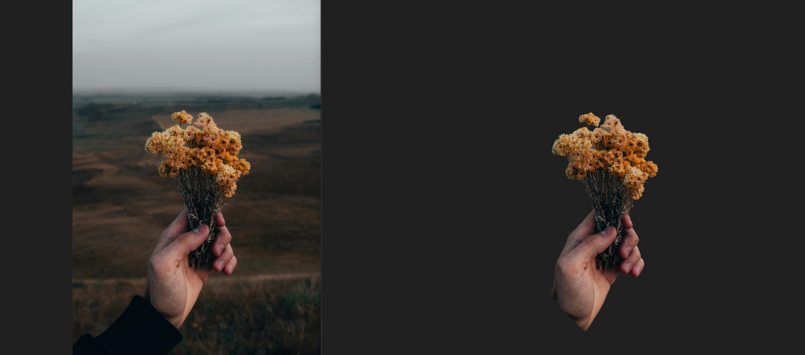

# [MNNMGMatting_meizu](https://github.com/Ruyue-Kinsenka/MNNMGMatting_meizu)


用于分离图片主体并生成遮罩图片

mmn模型来源于Flyme12.6.17版本内测

**仅供学习交流使用，下载后请于24小时内删除！！！！**

**仅供学习交流使用，下载后请于24小时内删除！！！！**

**仅供学习交流使用，下载后请于24小时内删除！！！！**


- 使用方法

  - 安装好需要的依赖后

  - 将需要抠出主体的图片放在该目录下并命名为input.jpg

    ```
    python3 model.py
    ```


# 效果展示





